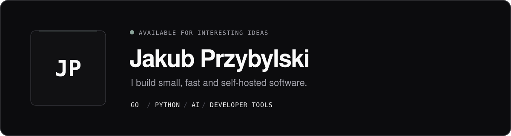

<div align="center">

<picture>
  <source media="(prefers-color-scheme: dark)" srcset="./assets/hero-dark.svg">
  <source media="(prefers-color-scheme: light)" srcset="./assets/hero-light.svg">
  
</picture>

<br>

[](https://encodeo.pl)
[](https://x.com/jacobbuilds_)
[](https://www.google.com/maps/place/Swarz%C4%99dz)

</div>

## Hello, I'm Jakub.

I build **small, fast tools that give people control back** — from terminal apps and AI-powered utilities to self-hosted infrastructure. I like software that is easy to run, pleasant to use and does one thing exceptionally well.

```go
focus := []string{"developer tools", "self-hosting", "local-first AI"}
philosophy := "ship useful things, keep the stack honest"
```

## Selected builds

<table>
  <tr>
    <td width="50%" valign="top">
      <h3><a href="https://github.com/przybylku/Gantry">Gantry ↗</a></h3>
      <p>A lightweight, self-hosted Vercel alternative. One binary, Docker-based deployments, zero platform overhead.</p>
      <p><code>Go</code> <code>Docker</code> <code>Self-hosted</code></p>
    </td>
    <td width="50%" valign="top">
      <h3><a href="https://github.com/przybylku/openbattery">OpenBattery ↗</a></h3>
      <p>A beautiful, responsive macOS battery monitor that lives exactly where developers work: the terminal.</p>
      <p><code>Go</code> <code>macOS</code> <code>CLI</code></p>
    </td>
  </tr>
  <tr>
    <td width="50%" valign="top">
      <h3><a href="https://github.com/przybylku/openfinance">OpenFinance ↗</a></h3>
      <p>An AI-powered finance tool for turning personal financial data into clear, useful insights.</p>
      <p><code>Go</code> <code>AI</code> <code>Finance</code></p>
    </td>
    <td width="50%" valign="top">
      <h3><a href="https://github.com/przybylku/askshell">AskShell ↗</a></h3>
      <p>An open-source, cross-platform CLI that brings AI answers and command-line help straight into your shell.</p>
      <p><code>Go</code> <code>AI</code> <code>Developer tools</code></p>
    </td>
  </tr>
</table>

## Toolbox

<p>
  
  
  
  
  
  
  
  
  
</p>

## What I'm into right now

- Building focused products in **Go** with tiny operational footprints.
- Exploring **AI that improves real workflows**, not AI added for decoration.
- Making self-hosting feel less like infrastructure work and more like using a product.
- Sharing practical notes and experiments at **[encodeo.pl](https://encodeo.pl)**.

<br>

<div align="center">

### Have an interesting idea?

I'm always happy to talk about developer tools, self-hosting and ambitious little products.

[](https://x.com/jacobbuilds_)

<sub><code>while (true) { learn(); build(); ship(); }</code></sub>

</div>
